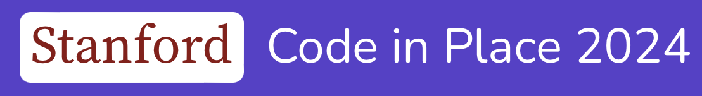

<!-- PROJECT LOGO -->
<br />
<div align="center">
  <a href="[https://github.com/github_username/repo_name](https://github.com/0ldcamel/codeinplace)">
    </a>
</div>

# Attending Stanford's Code In Place 2024

## My webpage on GitHub.
Here is my webpage in GitHub, containing my notes while attending the course.
<a href='https://0ldcamel.github.io/cip2024.html' target="_blank">0ld Camel attending Stanford's Code In Place 2024</a>

## My favorite posts and replies

### Using graphics module in VS Code:
[Using the graphics module in VS Code](https://codeinplace.stanford.edu/cip4/forum?post=ad0f48a5-9e07-41bc-a228-6076b676de98)
is an excellence answer by Micheal C

- `canvas.get_new_key_presses()` actually returns a list of key presses, not just a single keypress.  And the elements of that list aren't strings -- they're KeyPress objects, which have a `.keysym` member containing the key name.  Here's an example of how to get the actual key names for each keypress:

```
for key in canvas.get_new_key_presses():
    print(key.keysym)
```
- The key names themselves are also different from the names in the Code in Place graphics library. For example, instead of "ArrowLeft", it'll just be "Left".

- You need to call `canvas.update()` each time through your loop. Otherwise you won't see the changes you've made to the canvas, and you won't receive any new keypresses.

### Useful function in Graphic Project
```
def calculate_reference_area(canvas,obj,width,height):
    coords = canvas.coords(obj)
    return [*coords,coords[0]+width,coords[1]+height]
```
[SL Korey R explains](https://codeinplace.stanford.edu/cip4/forum?post=d43cce66-fb08-4da4-96d9-95da09e8af84) the use of the asterisk '*' in the return statement:
When placed to the left of an iterable, the star operator "unpacks" its contents. When placed to the right, it performs multiplication/duplication.

Unpacking is really useful when we want to do things with the contents that would be cumbersome via iteration:
```
def foo(a, b, c):
    print(a,c,b)

some_words = ["pineapple", "pizza", "belongs on"]

# foo expects a, b, c but my values are in a list
# I could make some temporary variables 
# and set a = some_words[0], b = some_words[1], ...
# or I could use *some_words, which does that for me!
foo(*some_words)
```
The output of the above is: _pineapple belongs on pizza_


<div align="center">&copy; 0ld Camel 2024</div>
